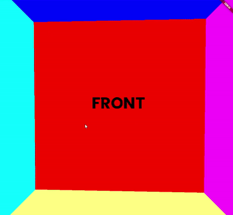

# sky_box

A sky box package for flutter.

|                               |                               |
| ----------------------------- | ----------------------------- |
|  |  |
|  |  |

Example Sky boxes by Emil Persson, aka Humus. [Their work](http://www.humus.name) is licensed under a [Creative Commons Attribution 3.0 Unported License](http://creativecommons.org/licenses/by/3.0/).

## Introduction

A sky box is a cube with 6 textures on the inside. The cube is constructed around the view point and warped to look like a sphere.



Each texture is a dart:ui Image object. 6 images are required, one for both positive and negative x, y and z axis.

| Axis | Image    |
| ---- | -------- |
| +x   | `right`  |
| -x   | `left`   |
| +y   | `top`    |
| -y   | `bottom` |
| +z   | `front`  |
| -z   | `back`   |

## Usage

```dart
class MyApp extends StatelessWidget {
  const MyApp({super.key});

  // This widget is the root of your application.
  @override
  Widget build(BuildContext context) {
    return MaterialApp(
      title: 'Flutter Demo',
      theme: ThemeData(
        colorScheme: ColorScheme.fromSeed(seedColor: Colors.deepPurple),
        useMaterial3: true,
      ),
      home: Scaffold(
        body: FutureBuilder<List<ui.Image>>(
          /// Load all images in parallel.
          future: Future.wait([
            _image('images/top.png'),
            _image('images/front.png'),
            _image('images/right.png'),
            _image('images/left.png'),
            _image('images/bottom.png'),
            _image('images/back.png')
          ]),
          builder: (context, snapshot) {
            if (snapshot.hasData) {
              /// Pass images to sky box.
              return Stack(
                children: [
                  /// Full screen sky box.
                  Positioned.fill(
                    /// Use sky box widget.
                    child: SkyBox(
                      top: snapshot.data![0],
                      front: snapshot.data![1],
                      right: snapshot.data![2],
                      left: snapshot.data![3],
                      bottom: snapshot.data![4],
                      back: snapshot.data![5],
                    ),
                  ),
                ],
              );
            }

            /// Show loading indicator while images are loading.
            return const Center(child: CircularProgressIndicator());
          },
        ),
      ),
    );
  }

  Future<ui.Image> _image(String path) {
    /// Load image from assets.
    return rootBundle.load(path).then((bytes) {
      return ui.instantiateImageCodec(bytes.buffer.asUint8List()).then((codec) {
        return codec.getNextFrame().then((frame) {
          return frame.image;
        });
      });
    });
  }
}
```
