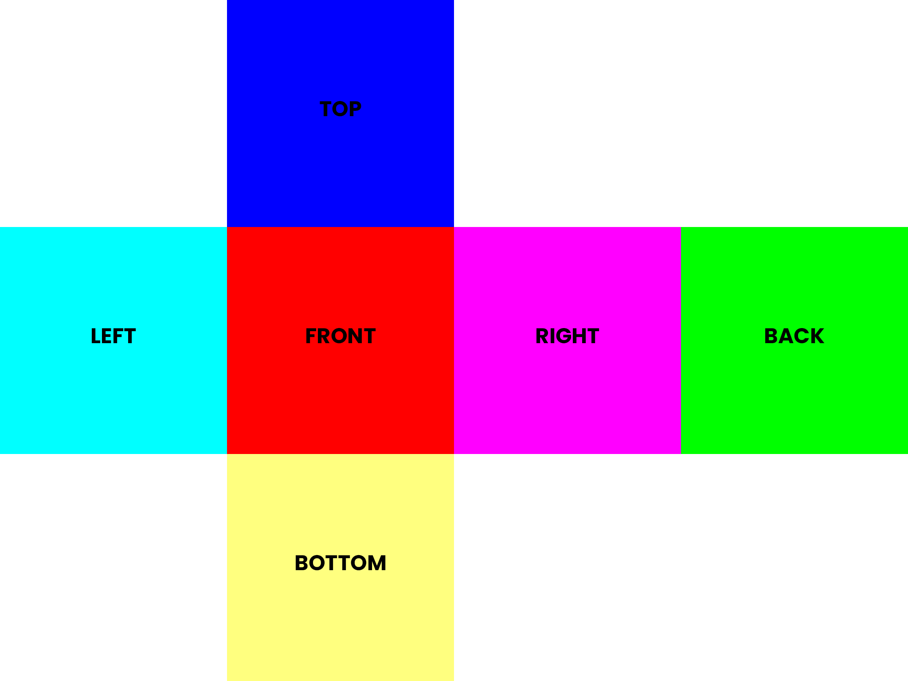

# sky_box

A sky box package for flutter.

|                               |                               |
| ----------------------------- | ----------------------------- |
|  |  |
|  |  |

Example Sky boxes by Emil Persson, aka Humus. [Their work](http://www.humus.name) is licensed under a [Creative Commons Attribution 3.0 Unported License](http://creativecommons.org/licenses/by/3.0/).

## Introduction

A sky box is created from a cube map texture, as shown below.



The cube is constructed around the view point and warped to look like a sphere.


## Usage

```dart
class MyApp extends StatelessWidget {
  const MyApp({super.key});

  // This widget is the root of your application.
  @override
  Widget build(BuildContext context) {
    return MaterialApp(
      title: 'Flutter Demo',
      theme: ThemeData(
        colorScheme: ColorScheme.fromSeed(seedColor: Colors.deepPurple),
        useMaterial3: true,
      ),
      home: Scaffold(
        body: FutureBuilder<ui.Image>(
          future: _image('images/map.png'),
          builder: (context, snapshot) {
            if (snapshot.hasData) {
              /// Pass images to sky box.
              return Stack(
                children: [
                  /// Full screen sky box.
                  Positioned.fill(
                    child: SkyBox(
                      image: snapshot.data!,
                    ),
                  ),
                ],
              );
            }
            /// Show loading indicator while image is loading.
            return const Center(child: CircularProgressIndicator());
          },
        ),
      ),
    );
  }

  Future<ui.Image> _image(String path) {
    /// Load image from assets.
    return rootBundle.load(path).then((bytes) {
      return ui.instantiateImageCodec(bytes.buffer.asUint8List()).then((codec) {
        return codec.getNextFrame().then((frame) {
          return frame.image;
        });
      });
    });
  }
}
```
